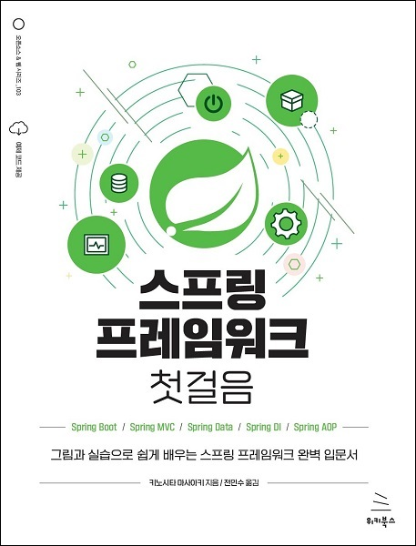

# 스프링 프레임워크 첫걸음
### 그림과 실습으로 쉽게 배우는 스프링 프레임워크 완벽 입문서

- 키노시타 마사아키 지음 | 전민수 옮김
- 25,000원 | 2022년 9월 21일 발행 | 320쪽 
- [책 홈페이지](https://wikibook.co.kr/spring/)
- [도서 미리보기](http://www.yes24.com/Product/Viewer/Preview/112607578)
- [도서 관련 문의](https://wikibook.co.kr/support/contact)

---

**세상에서 가장 친절한 스프링 프레임워크 입문서!**
 
스프링 프레임워크는 전 세계적으로 가장 널리 사용되는 오픈소스 자바 애플리케이션 프레임워크입니다. 이 책에서는 스프링 프레임워크를 처음 시작하는 분들을 위해 초보자의 눈높이에 맞춰 스프링 프레임워크를 설명합니다. 풍부한 그림과 실습을 통해 스프링 프레임워크에 관한 사전 지식이 없더라도 쉽게 이해하고 스프링 웹 개발을 시작할 수 있도록 도와줍니다.
 
이 책은 최신 버전인 스프링 프레임워크 5.3을 기반으로, 스프링 프레임워크를 이해하기 위한 자바 기초, 스프링 프레임워크의 핵심 원리, 웹 애플리케이션 개발을 위한 웹 애플리케이션의 동작 원리, 데이터 조작 방법, 스프링 MVC를 활용한 웹 애플리케이션 개발 등을 설명하고, 실제 웹 애플리케이션을 직접 만들어 보면서 스프링 프레임워크 기반의 웹 애플리케이션 개발 프로세스를 익히도록 구성돼 있습니다.

---
 
 ## 구입처
 
 - [예스24](http://www.yes24.com/Product/Goods/112607578)
 - [교보문고](http://www.kyobobook.co.kr/product/detailViewKor.laf?barcode=9791158393588)
 - [인터파크]()
 - [알라딘](https://www.aladin.co.kr/shop/wproduct.aspx?ItemId=301096602)
